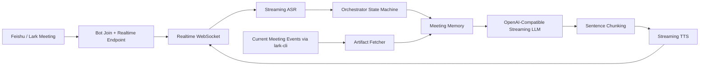
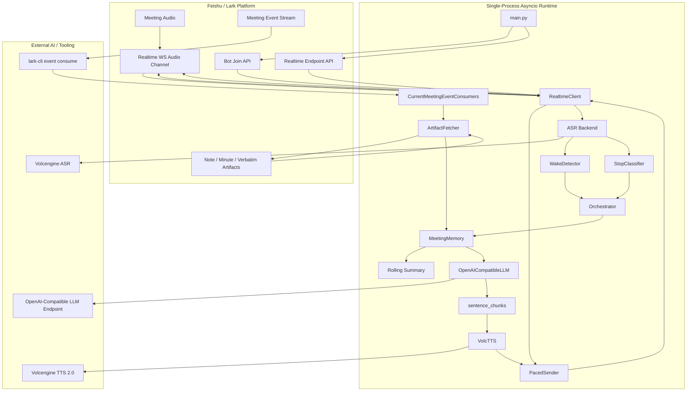

# Lark Meeting Talk Agent Technical Solution

## 1. Project Positioning

`lark-meeting-talk-agent` is a real-time voice assistant for Feishu/Lark meetings. It joins a meeting as a bot, listens continuously, answers spoken questions after wake-up, and maintains meeting memory for summaries, Q&A, review, and evaluation.

The product goal is not a generic voice chatbot. It is an English-first meeting assistant designed for real live demos and real meeting workflows:

- Stays silent by default and does not interrupt the meeting
- Enters continuous conversation after a wake word
- Supports barge-in and explicit stop / end-session control
- Builds meeting memory from both live conversation and current-meeting event artifacts
- Prioritizes stable live behavior over experimental architecture choices

## 2. Goals And Design Principles

### 2.1 Goals

- Join Feishu/Lark meetings reliably and exchange live audio
- Provide English-first real-time spoken Q&A
- Support summaries, decisions, action items, risks, and open-question tracking
- Combine conversation ability with meeting-level memory
- Ship a demoable prototype with a single-process, low-dependency design

### 2.2 Design Principles

- Stability over chasing the newest interface
- Latency over absolute maximum model quality
- Meeting context over single-turn answers
- Current-meeting scope over global event subscriptions
- Local `.env` runtime truth over older historical defaults in docs

## 3. Architecture Overview

The system uses a single-process `asyncio` architecture with one main real-time audio path and one parallel meeting-memory path.

### 3.1 High-Level Architecture



This high-level view emphasizes the two core ideas:

- A real-time voice interaction loop: audio in, answer out
- A parallel event-driven memory loop: meeting events and artifacts enrich context

### 3.2 Detailed Architecture



This detailed view shows the actual runtime shape:

- `main.py` owns process lifecycle, join mode, retries, and shutdown
- `RealtimeClient` owns Feishu Realtime session protocol
- `Orchestrator` owns state and behavior
- `MeetingMemory` is the shared context backbone
- `lark-cli event consume` adds a parallel current-meeting artifact path

## 4. Core Components

### 4.1 Entry Point And Lifecycle Control

The main entrypoint is [`main.py`](file:///Users/bytedance/workspace/open/lark-meeting-talk-agent/lark_meeting_voice/main.py).

It supports three startup modes:

- `--meeting-no`: this process performs `bots/join` itself
- `--meeting-id`: another service already joined; this process fetches the realtime endpoint
- `--ws-url`: another service already fetched the realtime WebSocket URL; this process attaches directly

Responsibilities:

- Validate runtime configuration
- Connect the realtime session
- Start the orchestrator
- Handle OS shutdown signals
- Retry with backoff for recoverable failures
- Force a leave before retry when stale publish conflicts occur

### 4.2 Realtime Audio Layer

The core implementation is in [`realtime.py`](file:///Users/bytedance/workspace/open/lark-meeting-talk-agent/lark_meeting_voice/lark/realtime.py).

This layer handles the Feishu Realtime stack:

- WebSocket binary transport
- Frontier Frame wrapping
- `meeting_realtime.v1` protobuf events

It does two jobs:

- Downstream: receive 24 kHz PCM audio from the meeting and pass it to ASR
- Upstream: send 24 kHz PCM audio generated by TTS back into Feishu for bot playback

Important engineering details:

- `session.create` must be sent promptly
- The runtime starts sending silence frames early to avoid session closure caused by missing upstream audio
- ACK frames must be handled correctly
- Recoverable realtime failures such as stale publish conflicts must trigger controlled shutdown and retry

### 4.3 Orchestrator State Machine

The core implementation is in [`orchestrator.py`](file:///Users/bytedance/workspace/open/lark-meeting-talk-agent/lark_meeting_voice/agent/orchestrator.py).

This module is the behavioral brain of the system. It coordinates:

- `RealtimeClient`
- ASR backend
- `WakeDetector`
- `StopClassifier`
- `MeetingMemory`
- `OpenAICompatibleLLM`
- `VolcTTS`
- `PacedSender`
- Current meeting event consumers

The state machine has three states:

- `WAITING`: always listening, never answering
- `ENGAGED`: wake-up has happened; follow-up questions do not need another wake word
- `SPEAKING`: the bot is talking and can be interrupted by user speech

Key behaviors:

- Wake word moves the session into `ENGAGED`
- Follow-up questions do not require repeated wake-up
- `stop`-style intents stop the current reply but keep the conversation session
- End-session intents return the bot to `WAITING`
- User speech during playback can trigger barge-in
- Low-value filler queries such as `ooh`, `uh`, or `hmm` are filtered

## 5. Meeting Memory Architecture

The core implementation is in [`meeting_memory.py`](file:///Users/bytedance/workspace/open/lark-meeting-talk-agent/lark_meeting_voice/memory/meeting_memory.py).

Meeting memory has two major input sources.

### 5.1 Conversation Memory

This comes from the real-time Q&A path:

- Passive ASR transcript
- User query
- Assistant reply

It is used for:

- Short-term conversational continuity
- Follow-up questions
- Incremental rolling-summary updates

### 5.2 Event-Driven Meeting Memory

This comes from current-meeting-scoped events and artifacts:

- `vc.note.generated_v1`
- `minutes.minute.generated_v1`
- `vc.meeting.participant_meeting_ended_v1`

After event capture, the system fetches:

- Note content
- Verbatim content
- Minute content

These are written into `MeetingMemory` and normalized into:

- Rolling summary
- Decisions
- Action items
- Risks
- Open questions
- Recent utterances

This is a key product decision: summaries and meeting memory should not rely only on ASR transcript. They should be driven by current-meeting events and official meeting artifacts whenever possible.

## 6. External Tools And Services

### 6.1 Feishu / Lark

The solution uses:

- `vc/v1/bots/join`
- `vc/v1/realtime/endpoint`
- Realtime WebSocket audio transport
- Meeting note / minute / transcript-related APIs and artifacts

### 6.2 `lark-cli`

`lark-cli` is a critical side-channel in this design.

It is used to:

- Run `lark-cli event consume`
- Filter events to the current meeting only
- Listen for note generation, minute generation, and meeting-ended signals

Compared with a transcript-only memory design, this path provides:

- More complete meeting-level information
- Better alignment with official meeting outputs
- A cleaner source of truth for summary tasks

### 6.3 Volcengine ASR

The codebase supports more than one ASR path, but the preferred stable runtime today is:

- `VOLC_ASR_BACKEND=legacy`
- `VOLC_ASR_WS_URL=wss://openspeech.bytedance.com/api/v2/asr`
- `VOLC_ASR_LANGUAGE=en-US`

This is an engineering choice made for live stability in English-first meetings, not because newer paths are conceptually worse.

### 6.4 OpenAI-Compatible LLM

The main implementation is in [`openai_compatible.py`](file:///Users/bytedance/workspace/open/lark-meeting-talk-agent/lark_meeting_voice/llm/openai_compatible.py).

Capabilities:

- OpenAI-compatible API client
- Streaming `chat.completions.create(stream=True)`
- First-token latency logging
- Conversation history
- Meeting memory injection
- Independent rolling-summary update path

Current stable model:

- `LLM_MODEL=doubao-seed-2-0-mini-260428`

Why this choice:

- Faster first token
- Better live-demo feel
- Good balance for spoken Q&A and lightweight meeting summary tasks

### 6.5 Volcengine TTS

The main implementation is in [`volc_tts.py`](file:///Users/bytedance/workspace/open/lark-meeting-talk-agent/lark_meeting_voice/tts/volc_tts.py).

The preferred path uses TTS 2.0 HTTP V3 unidirectional streaming and returns 24 kHz PCM that matches Feishu realtime playback requirements.

Current preferred demo voice:

- `zh_male_m191_uranus_bigtts`

Why it is preferred:

- Good bilingual stability
- Stronger English meeting-assistant tone
- More formal than the youth voice that was used earlier

Tradeoff:

- It sounds best overall for the demo, but can feel slightly over-performed

## 7. Key Runtime Flows

### 7.1 Real-Time Conversation Flow

```text
Meeting audio
  -> Realtime downstream
  -> downsample 24k -> 16k
  -> ASR partial / final
  -> wake / stop / session-state logic
  -> streaming LLM
  -> sentence chunking
  -> streaming TTS
  -> PacedSender
  -> Realtime upstream
```

### 7.2 Meeting Memory Flow

```text
Current meeting events
  -> event_consumer
  -> artifact_fetcher
  -> note / minute / verbatim content
  -> MeetingMemory
  -> rolling summary / structured facts
  -> meeting_context
  -> LLM answer / summary
```

## 8. Key Problems And Solutions

### 8.1 Why Not Just Do ASR -> LLM -> TTS

A real meeting assistant must do more than answer the latest sentence. Real user needs include:

- Summaries
- Review and recall
- Decision tracking
- Action-item extraction
- Evaluation of a presentation or discussion

A transcript-only design leads to:

- Noisy memory
- Weak long-range context
- Missing meeting-level facts

Solution:

- Move summary and long-lived meeting memory toward current-meeting event and artifact streams
- Keep ASR focused on wake-up and turn-by-turn interaction

### 8.2 Why Current-Meeting Scope Matters

Global event streams create two direct risks:

- Data pollution from other meetings
- Untrustworthy meeting memory

Solution:

- Build meeting-scoped `jq` filters in [`event_consumer.py`](file:///Users/bytedance/workspace/open/lark-meeting-talk-agent/lark_meeting_voice/lark/event_consumer.py)
- Consume only note, minute, and meeting-ended events for the current meeting

### 8.3 Why The Runtime Returned To Legacy ASR

The project experimented with newer ASR paths, including SDK-based routes and newer interfaces. In live English-first testing, those paths did not consistently outperform the prior setup in stability and user feel.

Solution:

- Freeze the live runtime to the stable combination:
- `legacy`
- `v2`
- `en-US`

This is a deliberate engineering tradeoff, not an architectural regression.

### 8.4 How “It Suddenly Stopped Talking” Was Solved

Several different issues can produce the same symptom:

- Stale publish session breaks the playback path
- State machine falls back to `WAITING`
- TTS never starts speaking
- LLM first token takes too long

Solutions:

- Detect recoverable realtime fatal errors and restart cleanly
- Force `leave` before retry on stale publish conflict
- Disable aggressive idle expiry by setting `ENGAGED_IDLE_TIMEOUT_S=0`
- Restore short-term memory flow so the system feels less “stuck”

### 8.5 Why English Input Sometimes Led To Chinese Output

The main causes were:

- Prompt language control was too weak
- English ASR text sometimes contained Chinese-style punctuation that confused language choice

Solutions:

- Use an English-first system prompt
- Normalize punctuation for English ASR output before downstream use

### 8.6 Why Replies Sounded Fragmented

The main causes were:

- TTS chunks were too small
- The first-sentence policy was poor for spoken delivery
- The prompt favored written or bullet-style output

Solutions:

- Keep streaming LLM, but split output into sentence-sized chunks in [`sentence_chunks`](file:///Users/bytedance/workspace/open/lark-meeting-talk-agent/lark_meeting_voice/llm/openai_compatible.py)
- Increase chunk sizes to a more natural spoken range
- Shift the prompt toward smooth spoken paragraphs instead of bullet lists

### 8.7 Why Barge-In Protection Matters

After a wake phrase such as “hey James, ...”, trailing ASR partials often continue to arrive shortly after reply start. If every partial is treated as a real interruption, the bot cancels itself before speaking its first sentence.

Solution:

- Only accept barge-in after TTS has truly started and has been audible for a short minimum window
- Preserve interruption ability without killing the first spoken answer

## 9. Recommended Runtime Profile

The current recommended stable local runtime profile is:

```env
VOLC_ASR_BACKEND=legacy
VOLC_ASR_WS_URL=wss://openspeech.bytedance.com/api/v2/asr
VOLC_ASR_LANGUAGE=en-US
LLM_MODEL=doubao-seed-2-0-mini-260428
VOLC_TTS_VOICE_TYPE=zh_male_m191_uranus_bigtts
ENGAGED_IDLE_TIMEOUT_S=0
LLM_TTS_CHUNK_MIN_CHARS=12
LLM_TTS_CHUNK_MAX_CHARS=100
```

Notes:

- `ENGAGED_IDLE_TIMEOUT_S` must appear only once
- `.env` is local runtime state and should not be committed as-is

## 10. Implementation Characteristics

### 10.1 Single-Process Async Architecture

Benefits:

- Simple deployment
- Short debugging path
- No broker or database dependency
- Very suitable for fast demos and frequent runtime tuning

### 10.2 Replaceable Component Boundaries

Even though the runtime strategy currently favors stability, the code already has useful boundaries:

- Swappable ASR backend
- Provider-neutral LLM layer
- TTS support for both v1 and v2 style paths
- Isolated meeting-memory module
- Isolated event-consumer and artifact-fetcher modules

This allows continued iteration without rewriting the entire runtime.

### 10.3 Strong Operational Observability

The system already has a practical log-driven diagnosis pattern:

- `ASR final`
- `Reply START`
- `LLM first token latency`
- `TTS audio started`
- `Reply DONE`

That makes live-demo debugging much faster.

## 11. Testing And Validation

The project already covers several important test categories:

- Realtime recoverable close behavior
- Event consumer meeting filter
- Artifact fetcher behavior
- TTS 2.0 end-of-stream handling
- ASR text normalization
- Conversation memory behavior
- Filler query filtering

Typical local verification:

```bash
python3 -m compileall lark_meeting_voice tests
python3 -m pytest
python3 -m lark_meeting_voice --help
```

For local-only `.env` tuning, the more important validation loop is:

- Restart the bot
- Confirm readiness logs
- Run a live meeting check

## 12. What To Emphasize In A Presentation

When presenting this solution to others, the strongest points are:

- This is a real meeting bot with real bidirectional audio, not an offline mock
- The architecture is not just ASR-LLM-TTS chaining; it adds meeting-level memory and event-driven summary inputs
- It combines turn-level voice interaction with meeting-wide contextual memory
- It solves practical meeting problems such as barge-in, stale realtime sessions, idle-state confusion, English-first language control, and TTS delivery quality
- It uses a single-process async architecture that is excellent for demos while still leaving room for deeper evolution

## 13. Future Evolution

- Introduce a more stable or faster English ASR path without hurting demo reliability
- Improve recognition correction for names, company terms, and meeting-specific terminology
- Use task-specific prompts or model strategies for summary, evaluation, and meeting QA
- Reduce runtime log noise further for cleaner operation
- Offer more formal and neutral TTS voice presets
- Move runtime control into a richer external orchestrator instead of a pure CLI process
